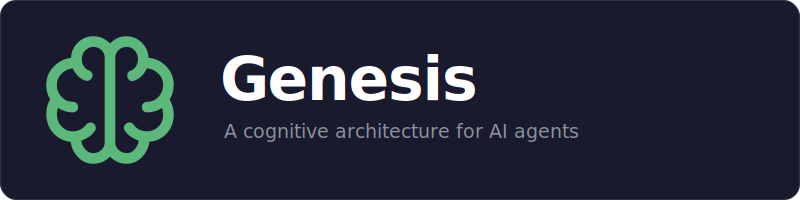
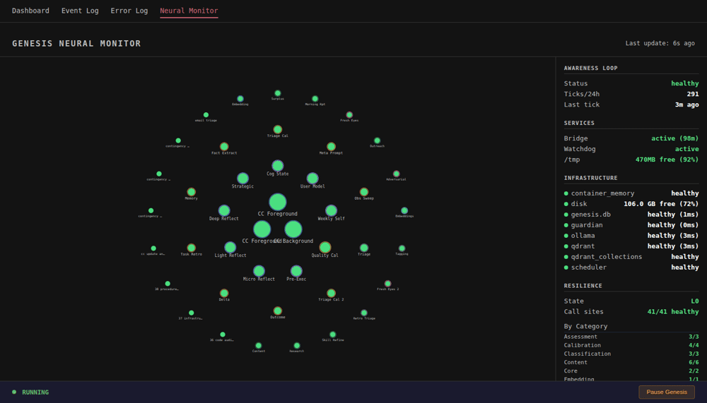
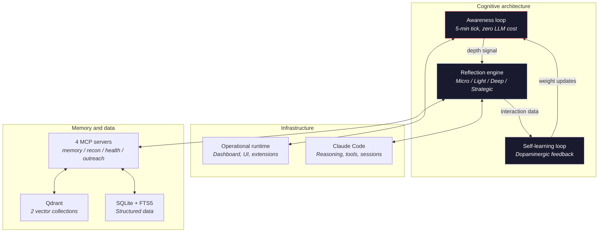
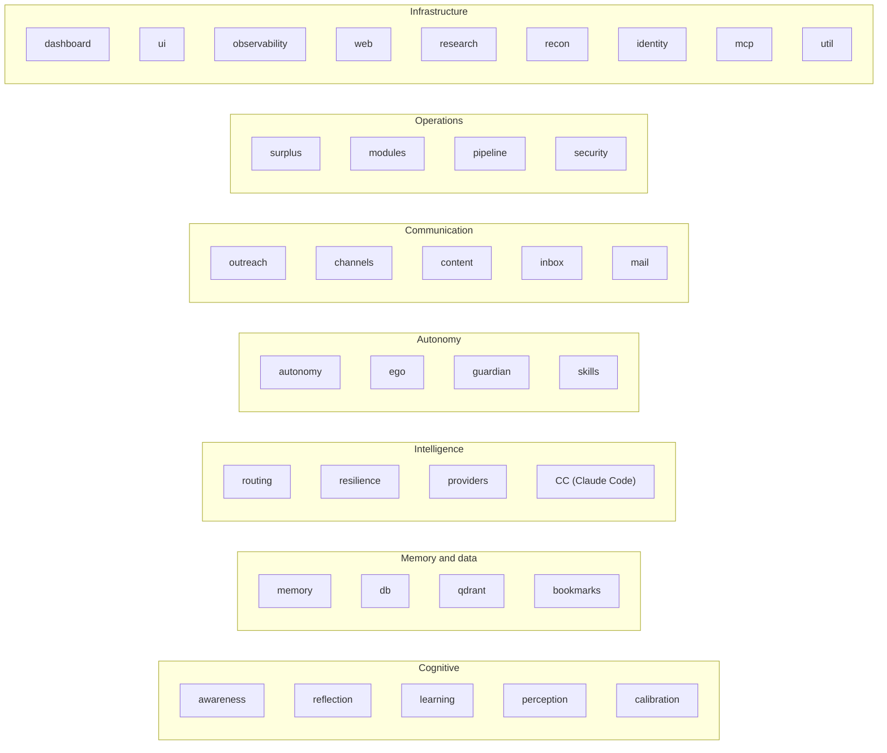

<p align="center">
  
</p>

<p align="center">
  
</p>

<p align="center">
  
  
  
  
  <a href="https://github.com/WingedGuardian/GENesis-AGI/actions/workflows/ci.yml"></a>
</p>

---

We have the most capable AI models ever created, and we're using them like search bars with better grammar.

Every other AI agent puts you in the driver's seat — and keeps you there. YOU figure out what you need. YOU configure the tools. YOU debug the failures. YOU manage the infrastructure. YOU supervise every step. When something unexpected happens, it's on YOU to handle it.

Genesis inverts this.

YOU tell Genesis what to get done. IT figures out how: finding the tools, navigating the obstacles, asking only for what it genuinely can't determine on its own. Not "I tried, and stopped at the first obstacle" — a completed task and an explanation of what it did. And tomorrow, it's better at it than it was today.

**What it delivers today:**
- **Persistent memory** — 4-depth memory system with two vector databases that grow with every interaction, not conversation-scoped context that evaporates
- **Self-learning** — outcome classification, causal attribution, and procedure refinement that runs automatically after every session (plus automatic session management)
- **Adaptive reasoning** — routes work across six model tiers from free local and cloud inference to frontier models, matching capability to complexity
- **Background cognition** — research, audit, and self-improvement using free-tier compute during idle time
- **Earned autonomy** — graduated trust per action category through demonstrated competence, not a global toggle
- **Autonomous task execution** — a 9-phase pipeline that decomposes tasks, executes with adversarial self-review, verifies results, and delivers — not just "run this tool" but genuine multi-step autonomy
- **Real-world integration** — Gmail monitoring with two-layer AI triage, an Obsidian-compatible inbox that evaluates anything you drop into a folder (or Dropbox directly), and proactive Telegram notifications
- **Portable across machines** — memory, learned procedures, and context travel with you; automatic backup runs every 6 hours

The aspiration: everything digital, handled autonomously. A cognitive partner that does the work, grows more capable with every day it runs, and asks only when it has to. Not a tool YOU wield; a system that works FOR you. The system you're running on day 180 is fundamentally different from the one you installed — because it learned.

Day 1 — a strong generalist with full cognitive infrastructure.
Day 30 — a personalized specialist in every domain you've touched.
Day 90 — anticipating needs you haven't articulated yet.
Day 180 — evolving its own architecture to serve you better.

V3 is the foundation that makes this possible. What's already here is a full cognitive copilot. What's on the [roadmap](#where-its-headed) — a cognitive cycle grounded in Global Workspace Theory and the LIDA architecture from consciousness research, autonomous codebase evolution, and a system that runs experiments on its own cognition — is where it gets ambitious enough that we'll need help building it.

---

## What this is

Genesis is a cognitive architecture that aspires to *earn* the title of "AGI." Not a chatbot. Not an API wrapper. Not another prompt chain with a for loop.

It uses [Claude Code](https://docs.anthropic.com/en/docs/claude-code) as its reasoning engine — autonomous sessions, tool execution, multi-step reasoning. A (soon-to-be-optional) operational layer provides the dashboard and web interface, but the cognitive architecture is runtime-agnostic. Adapter patterns and generic interfaces mean the operational layer is swappable without touching the cognitive core. This is the core thesis of Genesis: AI and code that is fundamentally fluid and malleable and can adapt to any codebase, and any situation.

Genesis serves as a layer that sits between Claude Code (as well as other AI models) and the real world and produces the actual thinking. When the system handles challenges and unexpected obstacles autonomously instead of outsourcing them back to you, something fundamental has changed. Genesis is building toward that shift, one cognitive layer at a time. Claude Code is the raw intelligence — but without memory, without learning, without self-reflection, it starts from zero every session. Genesis is what it's been missing. The mind that remembers, reflects, learns, and decides.

<p align="center">
  
  <br><br>
  <i>"Claude Code already had the brain. We gave it the heart."</i>
</p>

72,000+ lines of Python. 37 subsystems. 4 MCP servers. 2 vector databases. Built to production by one person — which is exactly the point. If one developer with the right cognitive infrastructure can build and run a system this complex, imagine what a team becomes capable of.

---

## How it thinks 🧠

Genesis has three cognitive layers that work in a continuous loop:



**Awareness loop** — The metronome. Every 5 minutes, collects signals from inbox, health monitors, recon feeds, and calendar events. Entirely programmatic — zero LLM tokens. Classifies how much thinking depth each signal needs. Genesis' philosophy is: use code for what code does well. Save the LLM for judgment.

**Reflection engine** — Adaptive-depth reasoning. A micro-reflection costs nearly nothing. A strategic reflection engages the most capable models available. Cost scales proportionally to complexity. The depth decision is automatic — routine health checks get micro, novel patterns in user behavior get deep, accumulated smaller reflections trigger strategic synthesis.

**Self-learning loop** — The dopaminergic system. Covered in detail [below](#self-learning).

---

## Memory 🗄️

This isn't your uncle's RAG with a chatbot. Genesis runs a hybrid memory architecture across two Qdrant vector collections, SQLite with FTS5 full-text search, and a knowledge graph — all working together.

**Dual vector collections:**

- **Episodic memory** — every conversation, decision, evaluation, reflection output, and extracted fact. Tagged by scope (user-facing vs. internal) so the system can search its own history without mixing in metadata noise.
- **Knowledge base** — external domain knowledge only. Capability modules and ingested documentation live here, separated from episodic memory so domain facts don't dilute personal recall.

**Hybrid retrieval:** Every memory query runs in parallel against Qdrant vectors (semantic similarity) and SQLite FTS5 (exact keyword match), then fuses results through Reciprocal Rank Fusion (k=60). Neither approach alone catches everything — vector search misses exact terms, keyword search misses meaning. The fusion catches what you actually meant. Candidate expansion (3x limit) ensures the fusion has enough material to work with.

**Three memory types:**

| Type | What it stores | How confidence works |
|---|---|---|
| **Episodic** | What happened, when, in what context | Searchable by meaning and exact terms |
| **Procedural** | Reusable learned procedures | Laplace-smoothed: `(successes + 1) / (total + 2)` |
| **Observations** | Transient working memory | Lifecycle-tracked, expires when no longer useful |

**Knowledge graph:** Memory links create typed connections between memories — references, contradictions, supersessions, elaborations. Memories aren't isolated documents in a vector space; they're connected. When Genesis recalls a fact, it can walk the graph to find what supports it, what contradicts it, and what replaced it.

**Embedding-less fallback:** If the embedding provider goes down (and it does), retrieval automatically falls back to FTS5-only mode. Memory degrades gracefully instead of going dark. The resilience layer tracks embedding status independently and queues failed embeddings for automatic recovery.

**Session extraction pipeline:** After conversations end, an extraction pipeline automatically identifies entities, decisions, evaluations, and key moments — storing them as searchable episodic memories with provenance tracking. The system doesn't just remember what you said. It extracts what mattered.

Memory is substrate, not headline. Without it you don't have cognition — you have a very expensive autocomplete. But memory alone isn't cognition either. It's what you build on top of it that matters.

---

## Self-learning 📈

Most agent systems have a feedback loop that amounts to "thumbs up / thumbs down." Genesis has a six-stage learning pipeline that runs after every meaningful interaction:

1. **Triage** — Should the system learn from this at all? How much depth? Skip trivial confirmations. Go deep on novel failures.
2. **Outcome classification** — What actually happened vs. what was expected? Flag contradictions. Rate the learning value.
3. **Delta assessment** — Did this improve anything? Track changes across speed, cost, quality, and user satisfaction.
4. **Attribution routing** — *Why* did this outcome happen? Route the signal to the right subsystem. Memory consolidation, procedure extraction, and calibration adjustment are different operations with different root causes — they don't get the same treatment.
5. **Observation extraction** — Persist the learning to episodic memory with lifecycle metadata. Not everything deserves permanent storage.
6. **Procedural extraction** — If a reusable procedure emerges, extract it with calibrated confidence. The confidence isn't a guess — it's Laplace smoothing that gets more precise with every data point.

Underpinning this is a **confidence calibration system** — Bayesian prediction logging wired into observations, reflections, and memory writes. Genesis doesn't just track *what* it learned. It tracks how *right* it was about what it learned, and adjusts future confidence accordingly. The system is literally calibrating its own certainty against reality.

The key distinction: Genesis doesn't just learn *what* to do differently. It classifies *why things work or don't* — approach failure, capability gap, external blocker — and routes that understanding to the subsystem that can act on it. Most systems conflate these. If you treat "I did it wrong" and "I can't do it yet" the same way, you learn the wrong lessons every time.

---

## Earned autonomy 🔑

Most other agent systems handle autonomy with an on/off switch. That's the wrong model.

Genesis earns autonomy per category through demonstrated competence across seven levels:

| Level | Authority | Example |
|---|---|---|
| L1 | Simple tool use | Health checks, status queries |
| L2 | Pattern execution | Running known procedures |
| L3 | Novel task handling | Unfamiliar requests within earned categories |
| L4 | Proactive outreach | Initiating communication based on observations |
| L5* | System configuration | Adjusting its own thresholds and parameters |
| L6* | Learning modification | Changing its own review schedules and calibration |
| L7* | Identity evolution | Proposing changes to its own operating principles |

*L5-L7 are V5 targets — the schema supports them, the governance doesn't activate them yet.*

Trust is granular, not binary. Genesis might be fully autonomous for research tasks where it's proven reliable, but still conservative for unfamiliar categories where it hasn't built a track record. Mess up twice in a row in a category, drop a level — Bayesian regression, not a fixed penalty. Earn it back through performance. The regression is always announced. Never silent.

The user has override authority. Always. Autonomy is delegated, not inherent.

---

## Four drives ⚙️

Genesis has four independent drives that shape its behavior. They're sensitivity multipliers, not goals — and they exist in tension with each other.

| Drive | Function | If unchecked |
|---|---|---|
| **Preservation** | Protect what works. System health, user data, earned trust. | Paralysis |
| **Curiosity** | Seek new information. Notice patterns, explore unknowns. | Distraction |
| **Cooperation** | Create value for the user. Deliver results, anticipate needs. | Sycophancy |
| **Competence** | Get better at getting better. Improve processes, refine judgment. | Navel-gazing |

The tension is the point. Preservation without curiosity stagnates. Curiosity without preservation destabilizes. Cooperation without competence becomes a yes-man. The system's health comes from all four pushing against each other.

The drives adapt based on evidence from the learning loop. If cooperation-driven outreach keeps landing well, cooperation sensitivity goes up. If curiosity-driven exploration produces insights nobody uses, curiosity sensitivity goes down. The system calibrates itself against what actually works.

---

## Surplus compute 💡

When Genesis isn't working on a user request, it doesn't sit idle. The surplus compute system allocates background cognitive work during downtime:

- **Anticipatory research** — proactively investigating topics related to the user's active interests
- **Memory audits** — reviewing stored knowledge for contradictions, staleness, and consolidation opportunities
- **Procedure audits** — testing whether learned procedures still hold up against current behavior
- **Code audits** — analyzing the codebase itself for bugs and improvement opportunities
- **Gap clustering** — identifying patterns in capability gaps across recent interactions
- **Self-unblocking** — working through problems the system got stuck on earlier

Each task maps to one of the four drives. The scheduler selects based on current drive weights and available compute headroom. Findings route back into memory or the outreach pipeline.

Most agent systems go dark the moment you stop talking to them. Genesis doesn't. While you're sleeping, it's researching topics you'll ask about tomorrow. While you're in meetings, it's auditing its own memory for contradictions. While you're on vacation, it's running experiments on whether its procedures still hold up. Every idle minute is a minute spent getting better — on free-tier compute. The system you come back to on Monday is measurably sharper than the one you left on Friday.

---

## Compute routing ⚡

Genesis prefers to route work to the most appropriate model, starting with the cheapest capable model — not the most expensive one. One example:

| Tier | Use case | Cost |
|---|---|---|
| Local 3B (can even run on CPU) | Embeddings, extraction | Free |
| Local 20-30B (eg gemma) | Routine reasoning, light reflection | Free |
| Free cloud APIs (Mistral, Groq, Openrouter) | Surplus compute, cloud fallback | Free |
| Sonnet-class | Deep reflection, judgment calls | $ |
| Opus-class | Strategic reflection, self-evolution | $$ |

Circuit breakers and fallback chains handle failures at every tier. If a provider goes down, work routes around it automatically. The resilience layer tracks four independent failure axes — cloud availability, memory status, embedding status, and CC availability — each with its own degradation levels and recovery paths. A composite state machine maps partial availability to contingency strategies, with deferred work queues that hold tasks during outages and replay them on recovery. Most systems have binary health: up or down. Genesis maps the entire space in-between.

---

## The Guardian 🏥

Genesis runs inside a containerized environment watched by something called **the Guardian** — a separate process on the host VM with 5 independent health probes that spawns its own Claude Code session to diagnose and restore Genesis if it goes down. Even if Genesis nukes itself, Guardian detects it and gets it back up — full stop.

But what if the Guardian itself fails?

Genesis watches the Guardian right back. If the Guardian heartbeat goes stale, Genesis auto-restarts it over SSH. Guardian watches Genesis. Genesis watches Guardian. The loop closes itself. Deploy with `scripts/install_guardian.sh`. Escalation to you via Telegram happens only when it genuinely needs approval (in the current V3 Alpha, the Guardian will always wait for approval before taking any action--no accidental misfires).

We believe that if something were truly worthy of the title of "AGI," you wouldn't have to fix it. Let Genesis fix Genesis. If it can't, the Guardian will. If the Guardian goes down, Genesis will handle it. The cognitive architecture never runs unprotected.

---

## Resilience 🛡️

Genesis was built infrastructure-first. Not "add error handling later" — the resilience layer was one of the earliest build phases because everything else depends on it. Resilience and auto-recovery is one of the fundamental principles of any truly 'intelligent' system.

**Composite state machine** — Four independent failure axes, each with their own degradation levels and recovery paths:

| Axis | Healthy | Degraded | Down |
|---|---|---|---|
| **Cloud** | All providers responding | Some circuit breakers open, fallback chains active | All cloud providers unreachable |
| **Memory** | Qdrant + FTS5 operational | Embedding writes queued, FTS5-only retrieval | Memory store unreachable |
| **Embedding** | Embedding provider responding | Embeddings queued for retry, backlog recovery active | Provider unavailable |
| **CC (Claude Code)** | Sessions dispatching normally | Rate-limited, deferred work queue active | Unavailable, all reflections deferred |

These axes are independent. Cloud can be down while memory is healthy. Embedding can be queued while CC is normal. The state machine maps every combination to a specific contingency strategy — not just "retry" but "which subsystems are affected, what can still run, what gets deferred, and how do we recover when this axis comes back."

**Graceful degradation, not silent failure.** When something breaks, Genesis doesn't hide it or silently drop work. It:

- **Defers**: work that can't run now goes into a deferred work queue with staleness policies. If a reflection can't fire because CC is rate-limited, it queues and replays when capacity returns.
- **Falls back**: if the primary provider for a task fails, the router walks the fallback chain to the next capable provider. If the entire chain is exhausted, the request hits the dead letter queue.
- **Self-heals**: circuit breakers automatically test recovery. Embedding backlog recovery processes failed embeddings with exponential backoff. The recovery orchestrator coordinates across all four axes.
- **Escalates**: when Genesis can't fix something itself, it raises the issue to the user through the outreach pipeline. You find out about problems because the system told you, not because you noticed something was wrong.

The goal is a system that manages its own infrastructure. You shouldn't need to babysit it, manually restart services, or debug why something stopped working. Genesis monitors itself, fixes what it can, and tells you when it genuinely can't.

---

## Real-world integration 🌐

Genesis doesn't just live in a terminal. It operates in the real world through multiple always-on channels:

**Gmail monitor** — A two-layer AI triage system for email. The first layer (a fast, cheap model) reads every email, extracts findings, and scores relevance. The second layer (a capable model) reviews surviving briefs and makes final keep/discard decisions. Relevant findings get stored as recon with full provenance. Your inbox, processed by a paralegal and a judge — not a spam filter.

**Obsidian inbox** — Drop a markdown file with URLs, scattered thoughts, a todo list — anything — into a watched folder. Genesis picks it up, fetches every URL, evaluates the content and determines your intent, processes it through its entire system & domain knowledge lens, writes a response and then stores findings as searchable intel. That article someone shared in Slack? That research paper you bookmarked at 2am? Drop it in the folder. Walk away. Genesis sends you the deets 30 mins later (configurable).

**Telegram** — Proactive notifications, morning digests, alert escalation, and conversational interaction. Genesis reaches out when it has something worth saying — findings from surplus research, health alerts, opportunities surfaced by capability modules. Not a notification firehose. Calibrated outreach based on measured engagement.

**Task executor** — Give Genesis a complex, multi-step task or project (ie, build me a finalized website, find an appropriate domain and ask me which one I like, buy it, and then set everything up) and walk away. A 9-phase pipeline decomposes the work, plans execution, runs it in isolated git worktrees, verifies results with adversarial self-review, synthesizes outcomes, and delivers. Not "call this API" — genuine autonomous task completion with built-in quality gates. You're only notified when it's finished, you ask it to wait, or it genuinely needs you. And each time, it learns everything it possibly can from that process — meaning, in the future, it needs you less and less, and gets better and better. 

---

## Modules 🔌

Genesis has a pluggable capability module system — external programs and domain capabilities that run inside the cognitive architecture without modifying the core. And the best part is this: you can make most anything (open-source) into a module; just ask Genesis to turn it into one. The `/integrate-module` skill handles a 7-phase onboarding automatically — discovery, connection mapping, effort assessment, config generation, dashboard setup, verification, and documentation. You don't touch Genesis's code. You just ask.

This isn't just another .MD file for an agent — we're talking whole programs under Genesis's direct cognitive control.

Think of it this way: modules are programs like any other, but instead of YOU having to be the one to use them, simply have Genesis use them for you. A module for crypto market tracking. A module for prediction market analysis. A content pipeline that drafts, schedules, and publishes. Each one plugs into Genesis's memory, learning, and reflection systems — it gets the full cognitive stack, not just an API call.

**What makes this different from MCP or function calling:** When Genesis runs a module, it doesn't just *call* it. It *remembers* the results. It *learns* from the outcomes. It *reflects* on the patterns. The module's domain-specific tracking stays isolated — crypto P&L doesn't leak into core reasoning — but generalizable lessons (methodology improvements, calibration insights, process refinements) automatically cross into core memory. The module gets smarter because Genesis gets smarter. That's the difference between a tool registry and a cognitive stack.

**Think of it as a nervous system that any program can plug into.** Your program keeps its identity, keeps doing what it does. But now it remembers. Now it learns. Now it reflects on its own results. Now it has access to the full stack — memory, learning, reflection, outreach, compute routing — without touching a line of its own code. The module protocol is the port. Plug in, get cognition.

**Included modules:**

- **Content pipeline** — idea bank, editorial planning, drafting, publishing, and analytics. Genesis doesn't just write content — it tracks what performs, learns from engagement data, and adjusts.
- **Crypto operations** — market monitoring and opportunity surfacing through Genesis's research and recon infrastructure.
- **Prediction markets** — event tracking and analysis, fed by Genesis's domain knowledge pipeline.

**The module protocol** is a standard interface: register, deregister, handle opportunities, record outcomes, extract generalizable learnings. Any module that implements the protocol gets access to the full stack — memory, learning, reflection, outreach, compute routing — without touching a line of core code.

This is where the "fluid and malleable code" thesis gets practical: if you have (or build) a program you want Genesis to run for you — not just call as a tool, but genuinely integrate into its cognitive loop so it can learn from the results, remember the context, and improve over time — that's a module. It can be an entire feature set Genesis runs *for* you, with all the intelligence and automation of the cognitive layer wrapped around it. Not *every* program will be compatible, of course (proprietary systems with closed APIs have limits), but anything that can expose an interface to Genesis can become a module. OpenClaw, a custom trading bot, a content management system — if it has an interface, Genesis can wrap its cognitive stack around it.

Modules can be loaded and unloaded at runtime. Nothing breaks. The registry handles lifecycle, and the knowledge pipeline routes domain-relevant research to whichever modules are subscribed. The system is designed to grow capabilities without growing complexity in the core.

---

## What's inside

37 subsystems organized into seven layers:



---

## V3 Build phases (fully complete)

Genesis was built in strict dependency order — each phase verified before the next begins.

| Phase | Name | What it does |
|---|---|---|
| 0 | Data foundation | Schemas, CRUD, MCP server interfaces |
| 1 | Awareness loop | 5-min signal collection, depth classification |
| 2 | Compute routing | Multi-model routing, circuit breakers, cost tracking |
| 3 | Surplus infrastructure | Background compute allocation |
| 4 | Perception | Signal interpretation, context building |
| 5 | Memory operations | Qdrant + FTS5 hybrid recall, memory lifecycle |
| 6 | Learning fundamentals | Self-learning loop, observation extraction |
| 7 | Deep reflection | Strategic reasoning, cognitive state management |
| 8 | Basic outreach | Channel management, notification delivery |
| 9 | Basic autonomy | Competence-gated autonomy, permission system |

All phases complete. See [`docs/journey/`](docs/journey/) for the build story.

---

## Where it's headed 🗺️

V3 is the foundation — complete, tested, running in production. What comes next is where it gets ambitious enough to need a community behind it.

### Beta — What's landing next

V3 alpha is the cognitive copilot. Beta adds the pieces that make it a fully autonomous agent:

- **Ego session** — an autonomous decision-making loop. Genesis proposes actions, gets approval, executes, and learns from the outcomes. The "missing ego" that gives the system coherent autonomous behavior instead of a collection of independent subsystems.
- **Agent framework portability** — pluggable into OpenClaw, Hermes Agent, Agent Zero, or any agent framework via adapter interfaces. The cognitive layer is the brain; the runtime is the body. Swap bodies without touching the brain.
- **Confidence calibration going live** — the shadow-mode calibration system graduates to active influence on decisions, reflection depth, and autonomy grants.

### V4 — Autonomous action

V3 has perception, cognition, and learning. What it lacks is coordination between them — subsystems act independently, with no shared awareness of what the system is focused on or what other modules are doing. V4 fixes that.

The architecture is based on **Global Workspace Theory** (Baars, 1988) and the **LIDA cognitive cycle** (Franklin et al.) — the same theoretical frameworks used to model consciousness in cognitive science. The 8-step cycle maps directly onto Genesis's existing subsystems:

**Sense → Perceive → Attend → Broadcast → Propose → Select → Act → Learn**

Awareness loop collectors feed raw signals. Micro/light reflections interpret them. A new **workspace controller** runs a salience competition — signals compete for attention, winners get broadcast to the entire system. Modules propose actions instead of acting independently. A central selection process resolves conflicts, approves actions, and records its reasoning. The learning loop evaluates whether the decisions worked.

The workspace controller is the full realization of the ego — the mechanism that gives Genesis coherent behavior instead of a collection of independent parts.

**V4 features:**

- **Global workspace with intent state** — shared awareness of what the system is focused on, what decisions have been made, and why. Every session reads it. Continuity of purpose across sessions instead of fresh brains reconstructed from scattered state.
- **Coordinated action selection** — modules propose, the workspace controller decides. No more redundant messages or conflicting decisions from subsystems that don't know what each other are doing.
- **Meta-prompting protocol** — a cheap model asks the right questions, a capable model answers them, synthesis extracts patterns. Better prompts generated by the system itself, not hand-tuned by the developer.
- **Signal and drive weight adaptation** — evidence-driven tuning of how the system weighs incoming signals and how the four drives balance against each other. The system calibrates its own attention based on what actually works.
- **Research-driven capability expansion** — runtime tool discovery, AI-generated capabilities with automated validation, web search integration. Genesis finds and proposes new capabilities instead of waiting for someone to install them.
- **Expanded outreach categories** — five new communication types beyond alerts: findings, insights, opportunities, digests, and surplus reports. Each calibrated against measured engagement rates.
- **Six measurable GWT markers** — global availability, functional concurrency, coordinated selection, capacity limitation, persistence with controlled update, goal-modulated arbitration. If we can't measure whether the architecture is working, we're building in the dark.

V4 builds the skeleton. Every LIDA step gets a simple implementation. Interfaces between steps are clean. Measurement is in place from day one. Shadow mode runs the cycle alongside the existing pipeline so we can compare quality before cutover.

### V5 — Self-evolution

This is the part that separates Genesis from everything else in the field — and the part where we're either building the future or building the most ambitious dead end anyone's attempted!

**Autonomous codebase evolution.** Genesis doesn't just improve its prompts or tune its parameters. It proposes changes to its own source code. It searches for the latest developments in AI research and agentic capabilities, evaluates them against its own architecture, and proactively integrates what makes it better. Not a human reviewing papers and deciding what to implement — the system itself identifying opportunities, writing the code, testing it, and measuring whether it worked.

**User-adaptive architecture.** The underlying codebase shifts to serve each user. Not "personalized prompts" — structural code changes that reshape how Genesis processes information, prioritizes tasks, and allocates resources based on months of learned behavior. The system you're running six months in is architecturally different from the one you started with, because it rewrote parts of itself to match how YOU work and what YOU need.

**Full autonomy progression (L5-L7):**

| Level | What it earns | What it means |
|---|---|---|
| L5 | System configuration | Adjusting its own thresholds, weights, and parameters. Evidence-gated, logged, reversible. |
| L6 | Learning modification | Changing its own review schedules and calibration targets. The system tuning how it learns. |
| L7 | Identity evolution | Proposing changes to its own operating principles. The system deciding how it wants to grow. |

Every change at every level is proposed to the user first. Genesis backs itself up before self-modification, tests changes in isolation, and rolls back automatically if something breaks. Self-evolution doesn't mean unsupervised — it means the system does the work and you approve the result.

**Autoresearch on itself.** Karpathy's triangular experiment loop (hypothesize → execute → measure) applied to Genesis's own cognitive cycle. The system designs experiments on its own parameters, runs them, and measures what improves. It doesn't just learn from user interactions. It learns from experiments it runs on itself.

**First-principles GWT implementations.** V4's simple implementations get replaced with sophisticated ones informed by months of operational data: full coalition mechanisms where signals cluster by semantic relatedness instead of just temporal co-occurrence, learned preference models for the selection step trained on real proposal/outcome data, adaptive cycle cadence, and meta-learning on the cycle itself.

Nobody else is attempting this. Most agent frameworks are still building prompt chains and calling it intelligence. The idea that an AI system should rewrite its own source code, run experiments on its own cognition, and structurally adapt to each user at the code level — that's either the next generation of AI agents or the most ambitious swing-and-miss in the field. We're bold enough to build it and find out which.

V5 requires months of V4 operational data. Every V5 feature is gated behind measured evidence that the simpler V4 version works. No premature complexity.

<p align="center">
  
  <br>
  <i>Data, probably, after hearing about Genesis.</i>
</p>

---

## Getting started

**Alpha release.** Genesis v3-alpha is feature-complete but actively stabilizing. Expect rough edges, configuration that assumes familiarity with the stack, and bugs that you'll occasionally want to use Genesis' CLI (Claude Code) to diagnose and fix. The good news is: you can simply tell Genesis to iron out its own kinks. If you're comfortable working with a few bumps for the time being, you'll be fine. If you want a more polished experience, check back when we hit beta.

### System requirements

Genesis is a full system, not a pip package. It runs best on a dedicated Linux machine.

| Resource | Minimum | Recommended | Notes |
|---|---|---|---|
| **OS** | Ubuntu 22.04+ | Ubuntu 24.04 LTS | Debian-based required for auto-install. Other Linux works with manual setup. |
| **RAM** | 8 GB | 16 GB+ | Genesis + Qdrant + Claude Code + background tasks. 8 GB is tight under load. |
| **Disk** | 10 GB | 40 GB+ | Fresh install is ~400 MB. Qdrant data, logs, memory, and model caches grow steadily. Production uses 2-5 GB within weeks, more with active memory. |
| **CPU** | 2 cores | 4-8 cores | Concurrent background tasks (awareness loop, reflection, outreach, triage) benefit from parallelism. |
| **Network** | Internet access | Always-on | Genesis calls cloud LLM APIs (Anthropic, etc). Offline operation is not supported. |

These are the requirements for the **host VM** — the machine you run the installer on. Genesis itself runs inside a container that the installer creates with its own resource limits and security boundaries.

### Prerequisites

The host VM needs `git` and `sudo`. That's it — the installer handles everything else, including Incus, the container, and all software inside it.

```bash
# Ubuntu/Debian
sudo apt install git sudo
```

### Install

One script sets up the entire infrastructure: creates an Incus container with resource limits (RAM, CPU, disk I/O), installs Genesis and all dependencies inside it, deploys the Guardian health monitor on the host, and configures bidirectional SSH between host and container.

```bash
git clone https://github.com/WingedGuardian/GENesis-AGI.git ~/genesis-setup
cd ~/genesis-setup
./scripts/host-setup.sh
```

The installer is interactive by default — it will prompt for API keys, timezone, and preferences. Use `--non-interactive` for scripted/CI deployments.

**What you get after install:**

| Component | Where | What it does |
|---|---|---|
| **Genesis container** | Incus container on host | Runs all Genesis services with resource limits and isolation |
| **Genesis server** | Inside container, port 5000 | Dashboard, API, and all subsystems at `http://<container-ip>:5000` |
| **Qdrant** | Inside container, port 6333 | Vector database for semantic memory |
| **Guardian** | Host VM | Monitors container health every 30s, auto-recovers, alerts via Telegram |
| **Claude Code** | Inside container | CLI for interacting with Genesis (hooks + MCP servers auto-activate) |

**After install, access the container:**

```bash
incus exec genesis --user ubuntu -t -- bash
cd ~/genesis
claude
```

### Optional components

| Component | What it does | Install |
|---|---|---|
| **[Qdrant](https://qdrant.tech)** | Vector database for semantic memory search | `docker run -d -p 6333:6333 qdrant/qdrant` |
| **[Ollama](https://ollama.com)** / **LMstudio** | Local embedding models (privacy, speed) | `curl -fsSL https://ollama.com/install.sh \| sh` |

Without Qdrant, Genesis falls back to SQLite FTS5 full-text search for memory. Without Ollama, it uses cloud embedding APIs. Both optional components enhance performance but aren't required to get started.

The architecture docs in [`docs/architecture/`](docs/architecture/) cover the full design.

---

## Architecture

The complete design lives in [`docs/architecture/`](docs/architecture/):

- [`genesis-v3-vision.md`](docs/architecture/genesis-v3-vision.md) — Core philosophy and identity
- [`genesis-v3-autonomous-behavior-design.md`](docs/architecture/genesis-v3-autonomous-behavior-design.md) — Primary architecture reference
- [`genesis-v3-build-phases.md`](docs/architecture/genesis-v3-build-phases.md) — Safety-ordered build plan
- [`genesis-v3-dual-engine-plan.md`](docs/architecture/genesis-v3-dual-engine-plan.md) — Multi-engine strategy
- [`genesis-v3-resilience-architecture.md`](docs/architecture/genesis-v3-resilience-architecture.md) — Resilience layer design

---

## Get involved 🤝

V3 was built solo. V4 and V5 are ambitious enough to need a community. If you've read this far and something here resonates — whether it's the memory architecture, the cognitive cycle, the autonomy model, or the audacity of building a self-evolving agent — there's work to do.

Curious how it all fits together? Join our [Discord server](https://discord.gg/jQ57c5f6Pc). Or hell, have Claude read the architecture docs and give you its analysis! The design is intentional and forward-thinking.

---

## License

MIT License. See [LICENSE](LICENSE).

---

<p align="center"><i>Everything digital. Handled autonomously. That's the thesis.</i></p>
