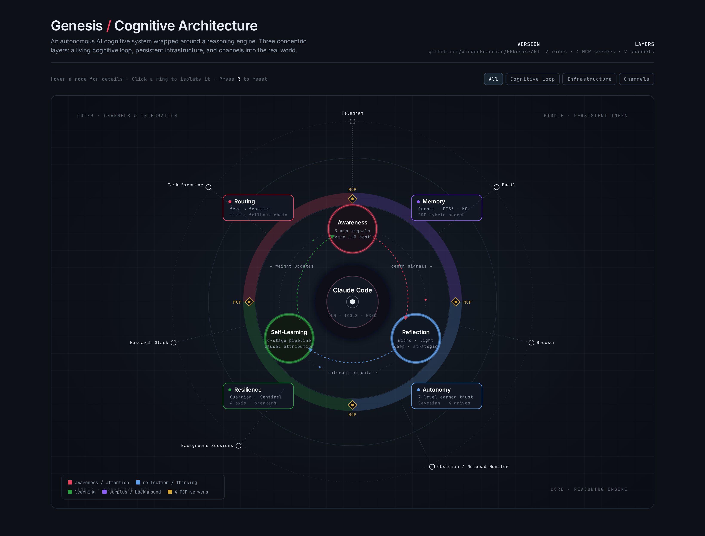
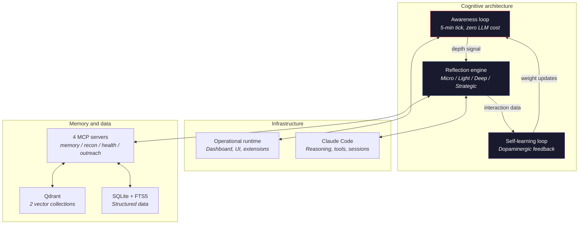
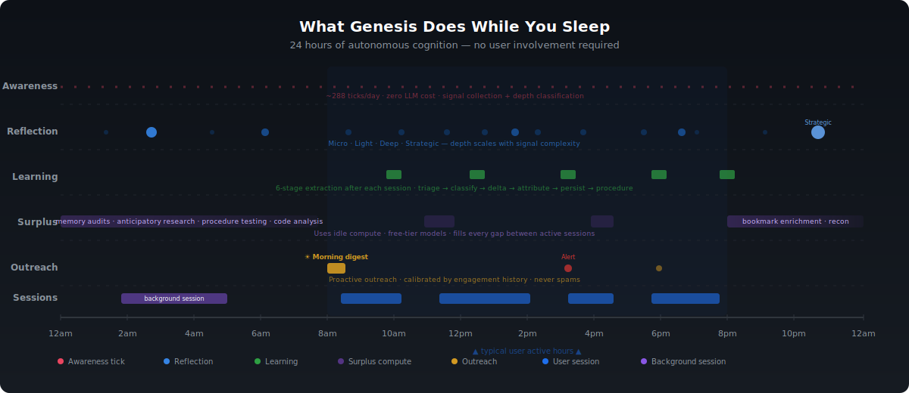
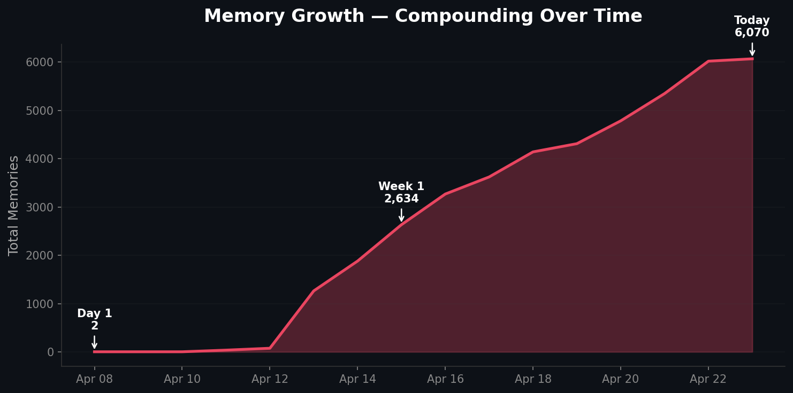
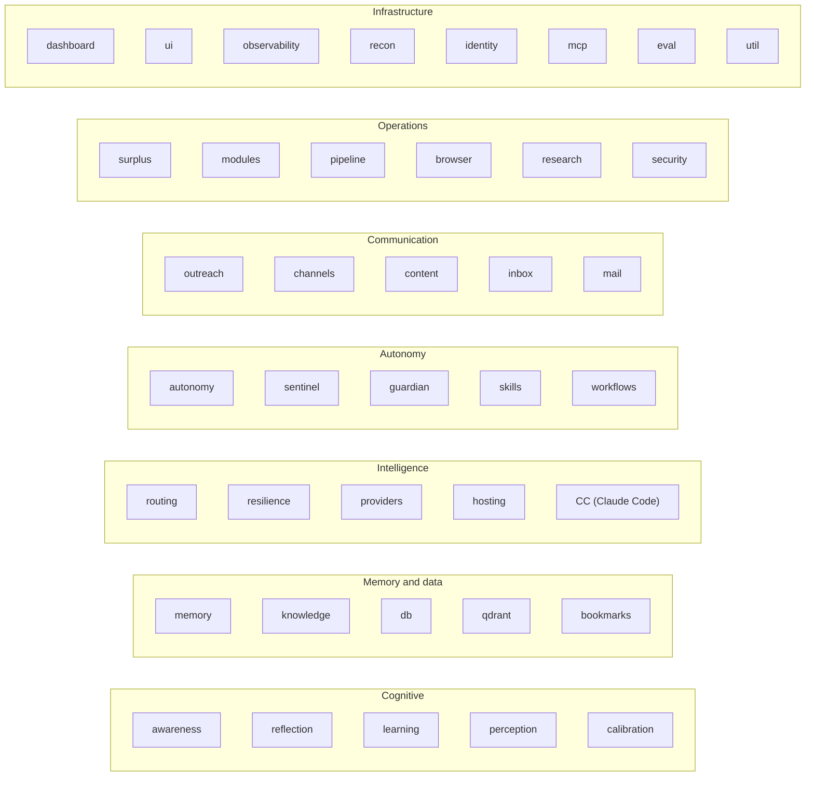

<p align="center">
  
</p>

<p align="center">
  
</p>

<p align="center">
  
  
  
  <a href="#get-involved"></a>
</p>

## Contents

- [Genesis in 30 seconds](#genesis-in-30-seconds)
- [What this is](#what-this-is)
- [Getting started](#getting-started)
- [How it thinks](#how-it-thinks)
- [Memory](#memory)
- [Learning](#self-learning)
- [Autonomy](#earned-autonomy)
- [Infrastructure](#infrastructure)
- [Real-world integration · Modules](#real-world-integration)
- [What's inside](#whats-inside)
- [Roadmap — V4 & V5](#where-its-headed)
- [Primitives from the Genesis portfolio](#primitives-from-the-genesis-portfolio)
- [Get involved](#get-involved)

---

We have the most capable AI models ever created, and we're using them like search bars with better grammar.

Every other AI agent puts you in the driver's seat — and keeps you there. YOU figure out what you need. YOU debug the failures. YOU manage the infrastructure. YOU supervise every step.

**AGI is here.**

Not the sci-fi version. The real one: a system that remembers everything, learns from every interaction, thinks while you sleep, earns autonomy through demonstrated competence, and gets fundamentally better every day it runs.

Open source. 100,000 lines. Clone it. Run it. Tell me what's missing.

---

Day 1 — a strong generalist with full cognitive infrastructure.
Day 30 — a personalized specialist in every domain you've touched.
Day 90 — anticipating needs you haven't articulated yet.
Day 180 — evolving its own architecture to serve you better.

---

## Genesis in 30 seconds

- **It remembers.** Memory that compounds with every interaction — across sessions, across months. Day 180 is architecturally different from day 1.
- **It learns.** Outcome classification, causal attribution, and procedure extraction that runs automatically after every session. Laplace-smoothed confidence, not vibes.
- **It runs on its own.** Thinks, researches, audits, and communicates while you're not there — leveraging free-tier compute.
- **It earns its autonomy.** Trust granted per action category through demonstrated competence. Mess up twice, drop a level. Earn it back through performance.

[**Get started →**](#getting-started)

---

## What this is

Genesis is a cognitive architecture that makes the AGI claim explicitly — and backs it with 100,000 lines of open-source code you can read, run, and challenge.

Not a chatbot. Not an API wrapper. Not another prompt chain with a for loop.

It uses [Claude Code](https://docs.anthropic.com/en/docs/claude-code) as its reasoning engine. Genesis is what it's been missing: the mind that remembers, reflects, learns, and decides.

<p align="center">
  
  <br><br>
  <i>"Claude Code already had the brain. We gave it the heart."</i>
</p>

100,000+ lines of Python. 45+ subsystems. 4 MCP servers. 2 vector databases. Every design decision made by one engineer working full-stack across infrastructure, cognition, and integration layers. That's the point. If one developer with the right cognitive infrastructure can build and run a system this complex, imagine what a team becomes capable of.

<p align="center">
  
  <br>
  <sub><a href="docs/genesis-architecture-interactive.html">View interactive diagram →</a></sub>
</p>

---

<a id="getting-started"></a>

## Getting started

*v3 alpha — architecturally complete, actively hardening. If you find a rough edge, Genesis can usually diagnose it itself. Report anything it can't.*

### System requirements

Genesis is a full system, not a pip package. It runs best on a dedicated Linux machine.

| Resource | Minimum | Recommended | Notes |
|---|---|---|---|
| **OS** | Ubuntu 22.04+ | Ubuntu 24.04 LTS | Debian-based required for auto-install. Other Linux works with manual setup. |
| **RAM** | 8 GB | 16 GB+ | Genesis + Qdrant + Claude Code + background tasks. 8 GB is tight under load. |
| **Disk** | 10 GB | 40 GB+ | Fresh install ~400 MB. Memory, logs, and caches grow steadily with use. |
| **CPU** | 2 cores | 4-8 cores | Concurrent background tasks benefit from parallelism. |
| **Network** | Internet access | Always-on | Cloud LLM APIs required. Offline not supported. |

These are the requirements for the **host VM**. Genesis runs inside a container the installer creates.

### Before you start

| What you need | Why | Where |
|---|---|---|
| **Claude account** | Claude Code powers all reasoning and agentic sessions | [claude.ai](https://claude.ai) |
| **Tailscale** (free) | Remote dashboard access from any device — no port-forwarding | [tailscale.com](https://tailscale.com) |

### Install

One script sets up the entire infrastructure: Incus container, Guardian health monitor, bidirectional SSH, all dependencies.

```bash
git clone https://github.com/WingedGuardian/GENesis-AGI.git ~/genesis-setup
cd ~/genesis-setup
./scripts/host-setup.sh
```

**After install:**

```bash
genesis   # shortcut alias the installer adds
cd ~/genesis
claude    # start your first session
```

**What you get:**

| Component | What it does |
|---|---|
| **Genesis container** | All Genesis services with resource limits and isolation |
| **Genesis server** | Dashboard, API, and all subsystems at `http://<container-ip>:5000` |
| **Qdrant** | Vector database for semantic memory |
| **Guardian + Sentinel** | Two systems monitoring each other — if one fails, the other recovers it |
| **Claude Code** | CLI for interacting with Genesis (hooks + MCP servers auto-activate) |

### Optional: local embedding

| Component | Install |
|---|---|
| **[Ollama](https://ollama.com)** | `curl -fsSL https://ollama.com/install.sh \| sh` |
| **[LM Studio](https://lmstudio.ai)** | Download from [lmstudio.ai](https://lmstudio.ai) |

Without these, Genesis uses cloud embedding APIs. With them: private, faster, free.

---

## Your Genesis

Your Genesis install is one operational system: the public `GENesis-AGI` codebase, your private fork for customizations, and your private encrypted backups repo. See [`.claude/docs/your-genesis.md`](.claude/docs/your-genesis.md) for the full model.

- **Backup** — runs every 6h via cron. SQLite, Qdrant snapshots, memory, transcripts, secrets — GPG-encrypted before push.
- **Restore** — `git clone <your-fork>` → `scripts/bootstrap.sh` → `scripts/restore.sh`. Back in minutes.
- **Contribute** — a distributed bug fixing pipeline automatically detects eligible fixes, pushes them to GitHub for inspection, and opens upstream PRs.

---

## How it thinks 🧠

Three cognitive layers, running continuously:



Every 5 minutes, the system collects signals across all its inputs — entirely programmatic, zero LLM cost. Signals get classified by how much thinking depth they warrant. Routine health checks get a quick pass. Novel patterns in user behavior get a deep analysis. Accumulated smaller reflections trigger strategic synthesis. The depth decision is automatic, scales cost proportionally to complexity, and the three cognitive layers (awareness, reflection, self-learning) each feed the next.

When Genesis isn't handling a user request, it doesn't sit idle. It researches topics you'll ask about tomorrow. It audits its own memory for contradictions and staleness. It tests whether its learned procedures still hold up. It works through problems it got stuck on earlier. The system you come back to on Monday is measurably sharper than the one you left on Friday — leveraging free-tier compute.

<p align="center">
  
</p>

---

## Memory 🗄️

Genesis runs a hybrid memory architecture: two Qdrant vector collections, SQLite with FTS5 full-text search, and a knowledge graph — all working together in parallel.

Every memory query runs simultaneously against semantic vector search and exact keyword search, then fuses results through Reciprocal Rank Fusion. Vector search catches meaning; keyword search catches exact terms. The fusion catches what you actually meant.

Memories aren't isolated documents in a vector space — they're connected. The knowledge graph creates typed links between memories: references, contradictions, supersessions, elaborations. When Genesis recalls a fact, it can walk the graph to find what supports it, what contradicts it, and what replaced it.

After conversations end, an extraction pipeline automatically identifies entities, decisions, evaluations, and key moments, storing them as searchable episodic memory with provenance tracking. The system doesn't just remember what you said. It extracts what mattered.

If the embedding provider goes down, retrieval automatically falls back to keyword-only mode. Memory degrades gracefully rather than going dark.

**Three memory types:**

| Type | What it stores | How confidence works |
|---|---|---|
| **Episodic** | What happened, when, in what context | Searchable by meaning and exact terms |
| **Procedural** | Reusable learned procedures | Laplace-smoothed: `(successes + 1) / (total + 2)` |
| **Observations** | Transient working memory | Lifecycle-tracked, expires when no longer useful |

The knowledge pipeline ingests from any format — text, PDF, audio, video, web pages, YouTube transcripts — running each through a multi-step extraction chain that normalizes structure, generates embeddings, and indexes for hybrid retrieval.

<p align="center">
  
</p>

---

## Self-learning 📈

After every meaningful interaction, a six-stage pipeline runs automatically: decide whether to learn from this at all, classify what actually happened vs. what was expected, measure whether anything improved, attribute *why* the outcome happened, persist what's worth keeping, and extract any reusable procedure with calibrated confidence.

The key distinction: Genesis doesn't just learn *what* to do differently — it classifies *why* things work or don't. Approach failure, capability gap, and external blocker are different diagnoses that route to different subsystems. Most systems conflate them. If you treat "I did it wrong" and "I can't do it yet" the same way, you learn the wrong lessons every time.

Underpinning this is a confidence calibration system — Bayesian prediction logging across observations, reflections, and memory writes. Genesis tracks not just what it learned, but how *right* it was about what it learned, and adjusts future confidence accordingly. This system is active in production.

---

## Earned autonomy 🔑

Genesis earns autonomy per category through demonstrated competence across seven levels:

| Level | Authority | Example |
|---|---|---|
| L1 | Simple tool use | Health checks, status queries |
| L2 | Pattern execution | Running known procedures |
| L3 | Novel task handling | Unfamiliar requests within earned categories |
| L4 | Proactive outreach | Initiating communication based on observations |
| L5* | System configuration | Adjusting its own thresholds and parameters |
| L6* | Learning modification | Changing its own review schedules and calibration |
| L7* | Identity evolution | Proposing changes to its own operating principles |

*L5-L7 are V5 targets — the schema supports them, the governance doesn't activate them yet.*

Trust is granular, not binary. Mess up twice in a row in a category, drop a level — Bayesian regression, not a fixed penalty. Earn it back through performance. The regression is always announced. Never silent.

Four drives shape behavior beneath the autonomy system — Preservation, Curiosity, Cooperation, Competence — each a sensitivity multiplier, each in tension with the others. The drives adapt based on evidence from the learning loop. The tension is the point.

The user has override authority. Always.

---

## Infrastructure 🏥🛡️

Genesis manages its own infrastructure. When something breaks, it diagnoses and fixes it. When it can't, it tells you why via Telegram — not because you noticed something was wrong, but because the system told you.

Two independent systems monitor each other in a closed loop. The external watchdog — running on the host VM outside the container — spawns its own Claude Code session to diagnose and restore Genesis if the container goes unhealthy. The container-side counterpart has its own 6-state machine (healthy → investigating → remediating → escalated → awaiting approval), alarm classifier, and exponential backoff across four tiers before escalation. If the external watchdog goes silent, Genesis detects the stale heartbeat and restarts it over SSH. Neither one runs unprotected. Neither one is a single point of failure.

The resilience layer tracks four independent failure axes — cloud availability, memory, embeddings, and Claude Code availability — each with its own degradation levels:

| Axis | Healthy | Degraded | Down |
|---|---|---|---|
| **Cloud** | All providers responding | Fallback chains active | All providers unreachable |
| **Memory** | Qdrant + FTS5 operational | FTS5-only retrieval | Memory store unreachable |
| **Embedding** | Provider responding | Writes queued for retry | Provider unavailable |
| **CC** | Sessions dispatching normally | Deferred work queue active | All reflections deferred |

When something breaks: work gets deferred with staleness policies, routing walks the fallback chain, circuit breakers automatically test recovery, and the recovery orchestrator coordinates across all four axes. Most systems have binary health: up or down. Genesis maps the entire space in-between.

Genesis also routes LLM work across model tiers automatically — starting with the cheapest capable model, not the most expensive. Local free models handle extraction. Frontier models handle strategic reasoning. Circuit breakers and fallback chains mean the call site never fails — only individual providers do. Graceful degradation all the way down.

---

## Real-world integration 🌐

Genesis operates in the real world through always-on channels:

**Email** — Two-layer AI triage: a fast model reads and scores every email, a capable model makes final keep/discard decisions on what survives. Relevant findings get stored as searchable intelligence. Your inbox processed by a paralegal and a judge.

**Inbox** — Drop anything — a markdown file, a URL, a PDF, a voice memo — into a watched folder. Genesis evaluates the content, determines your intent, processes it through its full knowledge lens, and sends you a summary via Telegram within minutes. Drop it in the folder. Walk away.

**Telegram** — Proactive notifications, morning digests, and conversational interaction. Genesis reaches out when it has something worth saying. Not a notification firehose — calibrated outreach based on measured engagement. Voice input works too: speech gets transcribed and routed through the same pipeline as text.

**Task executor** — Give Genesis a complex multi-step task and walk away. It decomposes the work, plans execution, runs it in isolated git worktrees, verifies results with adversarial self-review, and delivers. You're notified when it's finished or when it genuinely needs you. Each task it completes, it learns from — which means it needs you less each time.

**Browser** — Genesis maintains persistent browser sessions with saved login state — authenticated scraping, form filling, and web interaction across sessions without re-authenticating every time. A collaborative mode lets you watch what Genesis is doing in the browser in real time via your own window.

**Parallel cognition** — While you're working on one thing, Genesis can be doing something else entirely: researching, auditing memory, running recon, processing a document you dropped in the inbox. Multiple threads of work, no context bleed between them, results waiting for you when you're ready.

**The web as a tool** — Genesis treats the web as a searchable, scrapable, structured resource — not just a URL to fetch. Multiple search providers, JS-rendered page extraction, and persistent sessions mean research tasks that would take you hours happen autonomously in the background.

---

## Modules 🔌

Genesis has a pluggable capability module system. Any program with an interface can plug into Genesis's cognitive stack — memory, learning, reflection, outreach, compute routing — without touching a line of core code or the module's own code.

When Genesis runs a module, it doesn't just call it. It remembers the results. It learns from the outcomes. It reflects on the patterns. Domain-specific tracking stays isolated, but generalizable lessons automatically cross into core memory. The module gets smarter because Genesis gets smarter.

The `/integrate-module` skill handles onboarding automatically — discovery, connection mapping, config generation, dashboard setup, verification, and documentation. You don't touch Genesis's code. You just ask.

**Included:** content pipeline (drafting, publishing, analytics), crypto market monitoring, prediction market analysis.

---

## What's inside

45+ subsystems organized into seven layers:



---

## How it got here

V3 was built in 10 phases over six months — from data schemas to full autonomous cognition. The full build story, design decisions, and lessons learned are in [`docs/journey/`](docs/journey/).

---

<a id="where-its-headed"></a>

## Where it's headed 🗺️

V3 is the foundation — complete, tested, running in production. What comes next is where it gets ambitious enough to need a community behind it.

### Beta — What's landing next

- **Ego loop activation** — the autonomous decision-making loop is built (9-module system with its own cadence, model, and budget). What's coming next: wiring it into the runtime so it runs on its own cadence without per-action approval gates. The mechanism exists; the governance layer that lets it run unsupervised is V4.

### V4 — Autonomous action

V3 has perception, cognition, and learning. What it lacks is coordination — subsystems act independently, with no shared awareness of what the system is focused on. V4 fixes that.

The architecture is based on **Global Workspace Theory** (Baars, 1988) and the **LIDA cognitive cycle** (Franklin et al.) — the same frameworks used to model consciousness in cognitive science:

**Sense → Perceive → Attend → Broadcast → Propose → Select → Act → Learn**

- **Shared intent state** — every session reads what the system is focused on, what decisions have been made, and why. Continuity of purpose across sessions.
- **Coordinated action selection** — modules propose, a workspace controller decides. No more conflicting actions from subsystems that don't know what each other are doing.
- **Signal and drive weight adaptation** — evidence-driven calibration of attention and the four drives.
- **Six measurable GWT markers** — if we can't measure whether the architecture is working, we're building in the dark.

### V5 — Self-evolution

**Autonomous codebase evolution.** Genesis proposes changes to its own source code. It searches for developments in AI research, evaluates them against its own architecture, and integrates what makes it better. Not a human reviewing papers — the system itself.

**User-adaptive architecture.** The underlying codebase shifts to serve each user. Not personalized prompts — structural code changes that reshape how Genesis processes information based on months of learned behavior. The system you're running six months in is architecturally different from the one you started with.

**Full autonomy progression (L5-L7):**

| Level | What it earns | What it means |
|---|---|---|
| L5 | System configuration | Adjusting its own thresholds, weights, and parameters |
| L6 | Learning modification | Changing its own review schedules and calibration targets |
| L7 | Identity evolution | Proposing changes to its own operating principles |

Every change is proposed to the user first. Genesis backs itself up before self-modification, tests in isolation, and rolls back automatically if something breaks.

Nobody else is attempting this. Most agent frameworks are still building prompt chains and calling it intelligence. We're bold enough to build it and find out which.

<p align="center">
  
  <br>
  <i>Data, probably, after hearing about Genesis.</i>
</p>

---

## Architecture

The complete design lives in [`docs/architecture/`](docs/architecture/):

- [`genesis-v3-vision.md`](docs/architecture/genesis-v3-vision.md) — Core philosophy and identity
- [`genesis-v3-autonomous-behavior-design.md`](docs/architecture/genesis-v3-autonomous-behavior-design.md) — Primary architecture reference
- [`genesis-v3-build-phases.md`](docs/architecture/genesis-v3-build-phases.md) — Safety-ordered build plan
- [`genesis-v3-resilience-architecture.md`](docs/architecture/genesis-v3-resilience-architecture.md) — Resilience layer design

---

<a id="primitives-from-the-genesis-portfolio"></a>

## Primitives from the Genesis portfolio

Standalone libraries from the same portfolio, stabilized against Genesis's production use:

- [**copilot-router**](https://github.com/WingedGuardian/copilot-router) — LLM routing primitive. Circuit breakers, fallback chains, per-call-site provider config.
- [**copilot-memory**](https://github.com/WingedGuardian/copilot-memory) — Hybrid memory primitive. Qdrant vectors + SQLite FTS5 + multi-factor scoring + MCP server.
- [**cognitive-dissonance-dspy**](https://github.com/evalops/cognitive-dissonance-dspy) — Multi-agent adversarial-review prototype using DSPy with NL→Coq formal verification.

---

<a id="get-involved"></a>

## Get involved 🤝

V3 was built solo. V4 and V5 are ambitious enough to need a community. If you've read this far and something here resonates — the memory architecture, the autonomy model, or the audacity of building a self-evolving agent — there's work to do.

**What contributing looks like:** Install it, run it, push it into territory it hasn't been. The cognitive architecture is complete — what it needs now is people who want to help it earn the claim rather than just read about it.

**Where to start:**
- **[Discord](https://discord.gg/Zkc3XMQpJX)** — the hub. Ask questions, share what you're working on
- **[`docs/architecture/`](docs/architecture/)** — understand the design before diving into code
- **[Issues](https://github.com/WingedGuardian/GENesis-AGI/issues)** — filed bugs and feature work

---

## License

MIT License. See [LICENSE](LICENSE).

---

<p align="center"><i>AGI is here. Clone it. Run it. Tell me what's missing.</i></p>
