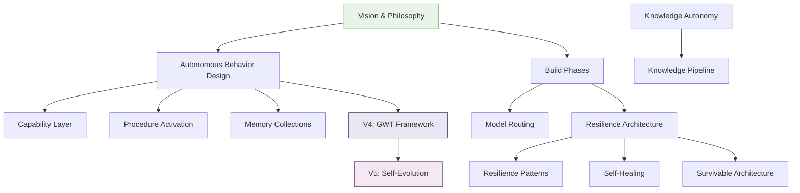

# Genesis Documentation

> A map of everything documented. Start wherever matches your interest —
> deep-dives for subsystem internals, case studies for what Genesis does
> in practice, architecture for design decisions, journey for how it was built.

---

## Start Here

- [README.md](../README.md) — What Genesis is
- [SETUP.md](../SETUP.md) — Installation and configuration
- [SECURITY.md](../SECURITY.md) — Security model and vulnerability reporting

---

## How It Works

Deep-dives into the subsystems that make Genesis work. Contributor-facing: understand
the internals well enough to modify them.

- [Multi-Provider Routing](architecture/routing-deep-dive.md) — Circuit breakers, rate
  gates, fallback chains, dead-letter recovery across 20+ providers
- [Hybrid Memory](architecture/memory-deep-dive.md) — 4-layer architecture, RRF fusion,
  activation scoring, graceful degradation
- [Earned Autonomy](architecture/autonomy-deep-dive.md) — Bayesian trust model, context
  ceilings, approval gates, enforcement layers

---

## Architecture

### V3 — Current

**Foundation**

- [Core Philosophy & Identity](architecture/genesis-v3-vision.md) — Who Genesis
  is and why it exists. The four drives, earned autonomy, LLM-first design.
- [Autonomous Behavior Design](architecture/genesis-v3-autonomous-behavior-design.md) —
  Primary architecture document. Drives, perception, reflection, learning, outreach.
- [Build Phases](architecture/genesis-v3-build-phases.md) — Safety-ordered build
  plan. Nine phases, each earning the right to build the next.
- [Agent Zero Integration](architecture/genesis-agent-zero-integration.md) —
  How Genesis runs on the Agent Zero framework.

**Subsystems**

- [Memory Collections](architecture/genesis-v3-memory-collections.md) —
  Episodic and knowledge memory architecture (SQLite + Qdrant).
- [Model Routing Registry](architecture/genesis-v3-model-routing-registry.md) —
  Which model handles which task, and why.
- [Procedure Activation](architecture/genesis-v3-procedure-activation.md) —
  How learned procedures are stored, recalled, and applied.
- [Capability Layer](architecture/genesis-v3-capability-layer-addendum.md) —
  Pluggable capability modules for domain-specific features.

**Resilience**

- [Resilience Architecture](architecture/genesis-v3-resilience-architecture.md) —
  System-level resilience: composite state machine, circuit breakers, fallback chains.
- [Resilience Patterns](architecture/genesis-v3-resilience-patterns.md) —
  Tactical patterns: embedding-less fallback, dead-letter recovery, provider health.
- [Self-Healing Design](architecture/genesis-v3-self-healing-design.md) —
  Automatic recovery: process supervision, state reconciliation, degraded operation.
- [Survivable Architecture](architecture/genesis-v3-survivable-architecture.md) —
  Operating under sustained degradation without data loss.

**Planning & Assessment**

- [Pre-Implementation Gap Assessment](architecture/genesis-v3-gap-assessment.md) —
  Risk analysis conducted before V3 build began.
- [Deferred Integrations](architecture/genesis-deferred-integrations.md) —
  Evaluated technologies parked for future consideration.
- [Knowledge Autonomy](architecture/genesis-knowledge-autonomy.md) —
  Concept design for autonomous knowledge acquisition.
- [Knowledge Pipeline](architecture/post-v3-knowledge-pipeline.md) —
  Post-V3 knowledge ingestion and staleness management.

**Historical**

- [Dual-Engine Plan](architecture/genesis-v3-dual-engine-plan.md) *(Superseded)* —
  Original three-engine model, replaced by current dual-runtime design.
- [Builder CLAUDE.md](architecture/genesis-v3-builder-claude-md.md) —
  The instruction set used to build Genesis V3.

### V4 — Designed

- [V4 Architecture](architecture/genesis-v4-architecture.md) — Global Workspace
  Theory as cognitive framework. Meta-prompting, drive adaptation, strategic
  reflection, expanded outreach, research-driven features, procedural decay.

Individual feature specs in `docs/plans/`:
- [Meta-Prompting](plans/v4-meta-prompting-spec.md)
- [Signal & Drive Weight Adaptation](plans/v4-signal-drive-weight-adaptation-spec.md)
- [Strategic Reflection](plans/v4-strategic-reflection-spec.md)
- [Expanded Outreach](plans/v4-expanded-outreach-spec.md)
- [Research-Driven Features](plans/v4-research-driven-features-spec.md)
- [Procedural Confidence Decay](plans/v4-procedural-confidence-decay-spec.md)

### V5 — Future

- [V5 Architecture](architecture/genesis-v5-architecture.md) — Self-evolution
  within guardrails. L5-L7 autonomy progression, hybrid agent protocol,
  GWT maturation, safety invariants.

Individual specs in `docs/plans/`:
- [Autonomy Progression (L5-L7)](plans/v5-autonomy-progression-spec.md)
- [Hybrid Agent Protocol](plans/v5-hybrid-agent-protocol.md)
- [Post-V5 Horizon](plans/post-v5-horizon.md)

---

## The Build Journey

The story of building Genesis — why each phase exists and what it taught us.

- [Origin Story](journey/origin-story.md) — From v1 (Nanobot) through v2 (Brain
  Architecture) to the v3 ground-up rebuild.

| Phase | Title | Focus |
|-------|-------|-------|
| 0 | [The Foundation](journey/phase-0-data-foundation.md) | Schema before code |
| 1 | [The Awareness Loop](journey/phase-1-awareness-loop.md) | Sensing the environment |
| 2 | [The Switchboard](journey/phase-2-compute-routing.md) | Intelligent routing |
| 3 | [The Idle Mind](journey/phase-3-surplus-infrastructure.md) | Surplus as leverage |
| 4 | [First Thoughts](journey/phase-4-perception.md) | From measuring to perceiving |
| 5 | [Memory](journey/phase-5-memory.md) | Persistent cross-session knowledge |
| 6 | [The Feedback Loop](journey/phase-6-learning.md) | Learning from everything |
| 7 | [Dreaming](journey/phase-7-deep-reflection.md) | Consolidation through reflection |
| 8 | [First Words](journey/phase-8-outreach.md) | Intelligence that communicates |
| 9 | [Earned Autonomy](journey/phase-9-basic-autonomy.md) | Trust through verification |

- [How Genesis Evaluates Itself](journey/how-genesis-evaluates-itself.md) —
  Self-assessment as structured introspection. The mirror.

---

## Case Studies

What Genesis does in practice. User-facing: concrete operational examples showing
what Genesis can do for you.

- [Provider Outages, Zero Interruption](case-studies/multi-provider-routing.md) —
  How Genesis handles provider failures without interruption
- [Three Months Later, It Remembers](case-studies/hybrid-memory.md) —
  How Genesis recalls context across months of sessions
- [Trust That Has to Be Earned](case-studies/earned-autonomy.md) —
  How Genesis earns and loses autonomy through demonstrated competence
- [Structured Research That Actually Researches](case-studies/deep-research.md) —
  How Genesis outperformed ChatGPT, Perplexity, and Gemini on a live benchmark

---

## Decisions

Architecture Decision Records — load-bearing choices with context and rationale.

- [ADR Index](decisions/README.md) — All recorded decisions
- [Genesis vs. CLAUDE.md AIOS](genesis-vs-claude-md.md) — Positioning and differentiation
- [Four C's Taxonomy](reference/four-cs-taxonomy.md) — Simpler external vocabulary

---

## Reference

- [Testing Guide](reference/testing.md) — Test suite organization, patterns, how to run
- [Troubleshooting](reference/troubleshooting.md) — Common issues and solutions
- [Models Reference](reference/models.md) — Supported models and routing assignments
- [Agent Zero Overview](reference/agent-zero-overview.md) — AZ framework basics
- [Agent Zero Deep Dive](reference/agent-zero-architecture-deep-dive.md) — AZ internals
- [Fork Tracking](reference/agent-zero-fork-tracking.md) — Genesis patches to AZ core
- [Lessons Learned](reference/genesis-lessons-learned.md) — Hard-won project wisdom
- [Project Rules](reference/genesis-project-rules.md) — Development conventions
- [CC Compatibility](reference/cc-compatibility.md) — Claude Code integration notes
- [Portability & Recovery](reference/recovery-and-portability-workflow.md) — Backup and restore

---

## Document Relationships

